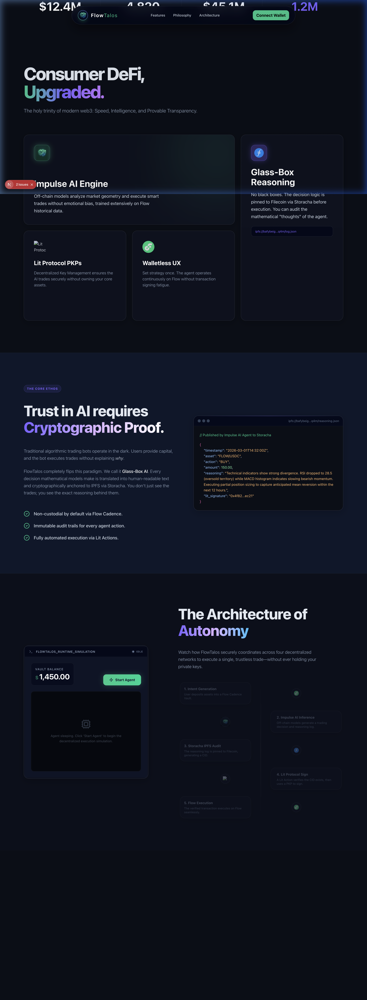

<p align="center">
  
</p>

# FlowTalos — Decentralized AI Wealth Management Protocol

> **Trustless, autonomous, and mathematically verifiable AI-driven asset management built natively for the Flow Blockchain.**

[](https://flow.com/)
[](https://nextjs.org/)
[](https://litprotocol.com/)
[](https://storacha.network/)

<p align="center">
  
</p>

---

## 📑 Table of Contents

1. [Problem Statement](#1-problem-statement)
2. [Solution](#2-solution)
3. [Key Features](#3-key-features)
4. [System Architecture](#4-system-architecture)
5. [Technology Stack](#5-technology-stack)
6. [Protocol Execution Flow](#6-protocol-execution-flow)
7. [Smart Contract Architecture](#7-smart-contract-architecture)
8. [AI Engine Design](#8-ai-engine-design)
9. [Security Model](#9-security-model)
10. [Folder Structure](#10-folder-structure)
11. [Installation Guide](#11-installation-guide)
12. [Environment Variables](#12-environment-variables)
13. [Running the Project](#13-running-the-project)
14. [Example Trade Log](#14-example-trade-log)
15. [Dashboard](#15-dashboard)
16. [Roadmap](#16-roadmap)
17. [Screenshots](#17-screenshots)
18. [Demo Section](#18-demo-section)
19. [Contributing Guide](#19-contributing-guide)
20. [Security Disclosure](#20-security-disclosure)
21. [FAQ](#21-faq)
22. [License](#22-license)
23. [Credits](#23-credits)

---

## 1. Problem Statement

The integration of Artificial Intelligence into Decentralized Finance (DeFi) trading has introduced a massive trust deficit. Current implementations suffer from critical flaws:

- **Black Box AI Execution:** Users surrender their assets to smart contracts with zero visibility into *why* the off-chain AI decided to swap tokens or rebalance liquidity at an exact moment.
- **Custodial AI Funds:** AI agents are typically granted direct access to a hot wallet or a custodial contract, requiring users to give up sovereignty over their assets.
- **Centralized Strategy Execution:** A single centralized server typically executes the trades, creating a massive single point of failure and centralization risk.
- **Lack of Transparency & Immutability:** Reasoning models are ephemeral. If an AI executes a catastrophic trade, there is no immutable audit trail to prove malfeasance versus natural market volatility.

---

## 2. Solution

FlowTalos completely reimagines AI wealth management by introducing a **"Glass-Box" architecture**, replacing blind trust with cryptographic verification.

- **Glass-Box AI:** Every single decision, mathematical calculation, and sentiment analysis made by the intelligence engine is exposed, logged, and verifiable.
- **Non-Custodial Vault:** The AI does *not* hold funds. Users deposit into native Cadence smart contracts. The AI functions strictly as an unprivileged *Strategist* that can only schedule predefined actions.
- **Cryptographic Reasoning Logs:** The exact parameters that triggered a trade are hashed and pinned to a decentralized storage network (IPFS/Storacha) before the trade even executes.
- **Threshold Transaction Signing:** The AI cannot blindly execute trades. Its proposed trades are validated and threshold-signed by a decentralized network of Lit Protocol nodes.

---

## 3. Key Features

- **Non-Custodial AI Trading:** Your keys, your crypto. The AI has delegated scheduling rights, not absolute withdrawal permissions.
- **Transparent Reasoning Logs:** Audit the AI's "thought process" for every single transaction via immutable IPFS CIDs.
- **Lit Protocol Decentralized Signatures:** Eliminates the centralized hot-wallet risk by utilizing Programmable Key Pairs (PKPs) and Threshold ECDSA signatures.
- **Flow EVM Cross-Liquidity Execution:** Leverages Cadence-Owned Accounts (COA) to allow highly secure Cadence vaults to execute deep-liquidity swaps on Flow EVM DEXs like IncrementFi.
- **On-Chain Scheduled Execution:** Trades are placed into a trustless execution queue utilizing the native Flow Transaction Scheduler.

---

## 4. System Architecture

```text
    [USER] 
      │ (Deposits Funds via UI)
      ▼
 ┌─────────────────────────┐
 │   FlowTalos Vault       │◄──────┐
 │   (Cadence Contract)    │       │
 └─────────────────────────┘       │ (Execute Scheduled TX)
                                   │
 ┌─────────────────────────┐   ┌─────────────────────────┐
 │   Synapse AI Engine     │──▶│ Flow Execution Scheduler│
 │   (Python Daemon)       │   │ (Cadence Timer Queue)   │
 └─────────────────────────┘   └─────────────────────────┘
      │               │                     ▲
  (Log Reasoning)   (Request Signature)     │ (Threshold Sign)
      ▼               ▼                     │
 ┌──────────────┐  ┌──────────────────────────────┐
 │ Storacha/IPFS│  │ Lit Protocol Action Nodes    │
 │ (JSON Proofs)│  │ (Validates & ECDSA Signs)    │
 └──────────────┘  └──────────────────────────────┘
                                            
                                            │ (Cross-VM Bridge)
                                            ▼
                                ┌─────────────────────────┐
                                │   Flow EVM (DEX Swap)   │
                                │   (IncrementFi/Metapier)│
                                └─────────────────────────┘
```

1. The **AI Engine** calculates a strategy.
2. It pushes its reasoning to **Storacha** (IPFS) to get a CID.
3. It sends the EVM Calldata + CID to **Lit Protocol**.
4. Lit Nodes validate the payload and sign a **Flow Cadence** transaction.
5. The transaction is submitted to the **Flow Scheduler**.
6. The Scheduler calls the **FlowTalos Vault** at the set time.
7. The Vault bridges the call to **Flow EVM** to execute the DEX swap.

---

## 5. Technology Stack

FlowTalos is built on a cutting-edge Web3 stack:

- **Flow Blockchain (Cadence):** The secure settlement layer. Manages the non-custodial user vaults and implements the transaction scheduling logic using resources and capabilities.
- **Flow EVM:** The liquidity layer. Executed via Cadence-Owned Accounts (COA) to access standard Solidity-based Automated Market Makers.
- **Lit Protocol:** Threshold cryptography sandbox. Validates AI payloads and applies decentralized signatures, preventing centralized AI key compromise.
- **Storacha / IPFS:** The decentralized ledger for AI reasoning. Ensures the "why" behind every trade is permanent and verifiable.
- **Next.js:** The frontend "Glass-Box" dashboard providing users with real-time portfolio metrics and IPFS proof streaming.
- **Python AI Agent (Synapse):** The autonomous multi-threaded backend engine responsible for scanning market geometry.
- **CoinGecko API:** Provides real-time quantitative price and volume data for RSI processing.
- **CryptoCompare API:** Ingests aggregate news headlines for real-time fundamental analysis.
- **Twitter/X Sentiment:** (Optional/Fallback) Scans social media API streams to measure retail fear, greed, and hype.

---

## 6. Protocol Execution Flow

1. **Data Ingestion:** The Synapse AI agent fetches current FLOW prices and global news headlines.
2. **Matrix Analysis:** The AI calculates the RSI and evaluates social sentiment (e.g., Bullish Technicals + Positive News = **BUY**).
3. **Payload Generation:** The agent constructs the exact EVM calldata required to swap tokens on a decentralized exchange.
4. **Audit Logging:** A JSON payload detailing the price, sentiment, and reasoning is pinned to Storacha/IPFS for an immutable CID.
5. **Decentralized Signing:** The payload and CID are sent to the Lit Action network. Lit validates the target contract and issues an ECDSA signature.
6. **Cadence Scheduling:** The signed transaction is broadcast to the Flow Testnet, pushing it into the Forte Scheduler queue.
7. **EVM Execution:** At the scheduled block, the FlowTalos Vault triggers its COA boundary, executing the raw calldata natively on Flow EVM.

---

## 7. Smart Contract Architecture

The protocol leverages the unique advantages of Cadence's resource-oriented paradigm:

- **Vault Contract (`FlowTalosVault.cdc`):** Holds human funds securely. It orchestrates the Cadence-to-EVM bridge (`executeEVMCalls()`) ensuring atomic batch execution.
- **Capability-Based Access:** The AI and Scheduler are granted restricted `Capabilities`. They do not have arbitrary withdrawal rights.
- **Scheduling Mechanism (`FlowTalosStrategyHandler.cdc`):** Integrates with the Forte Transaction Scheduler. Trades are queued and executed securely without hot-wallet cron jobs.
- **EVM Execution Bridge:** Uses a Cadence-Owned Account (COA) to securely wrap Solidity execution within Cadence transactions.

---

## 8. AI Engine Design

The **Synapse AI Engine** operates on a rigorous Dual-Signal matrix:

- **Market Analysis:** Computes Relative Strength Index (RSI) and 24-hour volatility metrics using CoinGecko time-series data.
- **Sentiment Analysis:** Parses textual news headlines and categorizes them into Negative, Neutral, or Positive vectors.
- **Signal Scoring:** A trade is *only* authorized if both signals align (e.g., Oversold Technicals + Positive Sentiment = BUY). If signals conflict, the AI preserves capital and holds.
- **Trade Execution Planner:** Autonomously encodes the precise `swapExactTokensForTokens` ABI hex strings utilizing the `eth-abi` library.

---

## 9. Security Model

Our zero-trust architecture protects user funds relentlessly:

- **Non-Custodial Vault:** The AI cannot withdraw your funds. Period.
- **Threshold Signatures:** No single server holds the private key that authorizes trades. A decentralized committee of Lit nodes must agree.
- **Deterministic Execution:** Smart contracts only accept specifically formatted ABI calls to whitelisted DEX router addresses.
- **Verifiable Reasoning Logs:** If a trade loses money, the exact dataset the AI was looking at is permanently etched into IPFS for public scrutiny.
- **Permission Boundaries:** Cadence strictly isolates user accounts from the strategy handler routines.

---

## 10. Folder Structure

```text
FlowTalos/
├── ai-agent/           # 🧠 Python intelligence daemon
│   ├── main.py         # Core analytical loop
│   └── test_agent.py   # Unit testing suite
├── cadence/            # ⛓️ Flow smart contracts & CLI config
│   ├── contracts/      # Vault and Strategy Handler
│   └── transactions/   # Setup scripts
├── lit-action/         # 🔑 Lit Protocol Javascript nodes
│   └── src/action.js   # Threshold validation script
├── storacha-logger/    # 📦 IPFS/Web3.Storage upload scripts
│   └── src/index.ts    # CIDv1 Hash generator
└── web/                # 🖥️ Next.js Glass-Box Frontend
    └── src/app/        # React components and dashboard UI
```

---

## 11. Installation Guide

### Prerequisites
- Node.js (v18+)
- Python (3.10+)
- Flow CLI

### Setup

```bash
# 1. Clone the protocol
git clone https://github.com/IrrhammCode/FlowTalos.git
cd FlowTalos

# 2. Install Web Dependencies
cd web && npm install && cd ..

# 3. Install Lit & Storacha Dependencies
cd lit-action && npm install && cd ..
cd storacha-logger && npm install && cd ..

# 4. Setup Python AI Environment
cd ai-agent
python3 -m venv venv
source venv/bin/activate  # On Windows: venv\Scripts\activate
pip install -r requirements.txt
cd ..
```

---

## 12. Environment Variables

Create `.env` files based on the `.env.example` templates in the respective directories. 

**Example `ai-agent/.env`:**
```ini
# Flow Testnet Signer
FLOW_TESTNET_SIGNER=24c2e530f15129b7

# API Integrations
COINGECKO_API_KEY=your_key_here
CRYPTOCOMPARE_API_KEY=your_key_here
TWITTER_BEARER_TOKEN=your_token_here

# EVM Node
FLOW_EVM_RPC_URL=https://testnet.evm.nodes.onflow.org
```
*(Note: FlowTalos includes offline cryptographic fallbacks. If API keys for Storacha or Lit are missing during local evaluation, the Python agent deterministicly simulates the cryptographic proofs locally).*

---

## 13. Running the Project

FlowTalos utilizes concurrent architecture. To boot the platform:

**Start the Next.js Frontend:**
```bash
cd web
npm run dev
# Dashboard live at http://localhost:3000
```

**Boot the Synapse AI Daemon (New Terminal):**
```bash
cd ai-agent
source venv/bin/activate
python3 main.py --daemon
```

*For smart contract administration, refer to the deploy scripts within the `cadence/README.md` file.*

---

## 14. Example Trade Log

Every trade generates an immutable cryptographic footprint. Example Storacha IPFS JSON payload (`trade_log.json`):

```json
{
  "timestamp": "2026-03-11T21:45:10.123456",
  "action": "BUY",
  "token": "FLOW",
  "amount": 100.0,
  "price_snapshot": 0.842,
  "news_sentiment": "positive",
  "target_dex_evm": "IncrementFi",
  "evm_calldata": "0x38ed173900000000000...",
  "dex_router": "0xRouterAddress",
  "reasoning": "Dual-Signal Alignment! Technicals: FLOW shows oversold conditions (Drop of -5.4%). Qualitative: Social sentiment is POSITIVE. Executing BUY via IncrementFi.",
  "ipfs_cid": "bafybeicm... (Base32 CIDv1)",
  "tx_status": "PENDING"
}
```

---

## 15. Dashboard

The Next.js Glass-Box dashboard is the investor's command center:
- **Portfolio Overview:** Real-time metrics on Total Value Locked (TVL) and automated yields.
- **AI Execution Stream:** A live, auto-polling terminal interface displaying the absolute latest decisions transmitted by the Python Daemon.
- **Cryptographic Receipts:** A secure table detailing recent trades, specifically highlighting the clickable **IPFS Proof CID** and transaction statuses.
- **Strategy Performance:** Visual charts plotting asset prices against the AI's execution epochs.

---

## 16. Roadmap

1. **Phase 1: Hackathon MVP (Current)** - Read-only Testnet execution, offline architectural proofs, Cadence + EVM routing.
2. **Phase 2: Mainnet Alpha** - Live deployment on Flow Mainnet, integrated with production Lit PKP infrastructure and audited smart contracts.
3. **Phase 3: Decentralized Autonomous Organization (DAO)** - Protocol governance for whitelisting new synthetic assets and modifying AI risk parameters.
4. **Phase 4: Strategy Marketplace** - Permitting third-party quantitative developers to plug their own custom AI algorithms into the FlowTalos vault infrastructure securely.

---

## 17. Screenshots placeholders

### Web Dashboard
<p align="center">
  
</p>

### Cryptographic Audits
*(Space reserved for future on-chain FlowTx Explorer screenshots)*

---

## 18. Demo Section

Watch the FlowTalos architecture in action, demonstrating the end-to-end flow from deposit, to AI analysis, to IPFS pinning, Lit signing, and Cadence execution.

**[▶️ Click here to watch the Hackathon Demo Video](#)** *(Link pending upload)*

**Live Demo URL:** `https://flowtalos.vercel.app/` *(Link pending deployment)*

---

## 19. Contributing Guide

We welcome contributions from Web3 developers, quantitative analysts, and Cypherpunks.
1. Fork the repository.
2. Create a feature branch (`git checkout -b feature/AdvancedRSIStrategy`).
3. Commit your changes strictly using Conventional Commits.
4. Push to the branch and open a Pull Request against `main`.

---

## 20. Security Disclosure

FlowTalos is a Hackathon prototype. **DO NOT DEPLOY OR USE IN PRODUCTION WITH REAL ASSETS.** The Cadence smart contracts, Node wrappers, and Python algorithms have not undergone independent third-party mathematical or security audits. 

If you discover a vulnerability in the COA bridging mechanism or the Forte scheduling queue, please open an Issue with the prefix `[SECURITY]`.

---

## 21. FAQ

**Q: Does the AI hold my private keys?**
No. The AI agent holds absolutely no keys. It constructs unsigned payloads and relies on Lit Protocol to threshold-sign transactions, which only authorize pre-approved execution bounds.

**Q: What happens if the AI server goes offline?**
User funds remain 100% safe in the Cadence smart contract. The AI simply ceases to schedule new trades until rebooted. Users can manually withdraw their deposits at any time.

**Q: Why Flow Blockchain?**
Flow allows native execution of both resource-oriented (Cadence) logic—which is vastly superior for vault security—and Account Abstraction-style EVM interactions through Cadence-Owned Accounts (COA). It is the perfect ecosystem for cross-VM artificial intelligence.

---

## 22. License

This protocol is released under the **MIT License**. See the `LICENSE` file for full disclosure.

---

## 23. Credits

Engineered for the **"Flow: The Future of Finance" Hackathon**.
- Built by [IrhammCode](https://github.com/IrrhammCode)
- Powered by **Flow**, **Next.js**, **Lit Protocol**, and **Storacha**.
