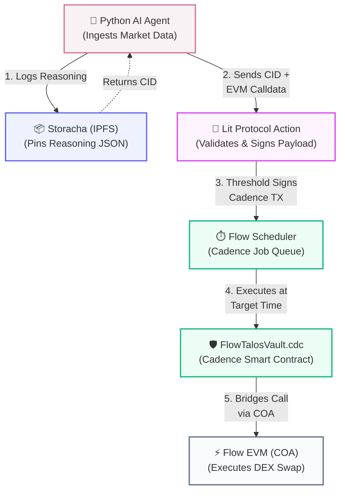

# 🤖 FlowTalos: Trustless AI Wealth Management Protocol

[](https://flow.com/)
[](https://nextjs.org/)
[](https://litprotocol.com/)
[](https://storacha.network/)

FlowTalos is a decentralized, non-custodial asset management protocol powered by an autonomous computational intelligence agent. Built exclusively for the **Flow Evm/Cadence environment**.

It solving the specific problem of "Black Box AI Agents" in DeFi by leveraging cross-VM infrastructure alongside specialized cryptographic networks (Lit Protocol & Storacha/IPFS). FlowTalos provides a mathematically verifiable execution flow—a "Glass-Box" architecture where every decision the AI makes is logged, cryptographically signed, pinned to decentralized storage, and executed deterministically on-chain.

## 🌟 The Problem
AI agents in DeFi suffer from a massive trust deficit. 
1. **Black Box Execution:** Users surrender their funds to a smart contract, but have zero visibility into *why* the off-chain AI decided to swap tokens or rebalance liquidity at that specific exact second.
2. **Private Key Risk:** AI agents are usually granted complete control over a hot wallet holding the vault's assets, creating a massive single point of failure (centralization risk).
3. **Immutability:** The reasoning models driving the AI are ephemeral; if the AI makes a bad trade and loses funds, there is no immutable audit trail to prove malfeasance vs. market conditions.

## 💎 The FlowTalos Solution
FlowTalos fixes this by utilizing the **Flow Transaction Scheduler** pattern, where the AI does not hold funds. Instead, it acts as an unprivileged *Strategist*. Users maintain control of their Cadence Owned Accounts (COA) while simultaneously delegating scheduling rights for specific whitelisted EVM strategy actions. 

Every action the AI takes goes through our "Glass-Box" pipeline:
1. **Analyze:** AI fetches real-time market data (CoinGecko).
2. **Plan (Calldata):** AI generates the exact EVM calldata for the DEX operation (e.g. `swapExactTokensForTokens` on IncrementFi targeting the Flow EVM).
3. **Audit (Storacha):** AI compiles a JSON reasoning log explaining the *why* (market RSI, volatility), and computes an IPFS CID via the **Storacha Protocol**.
4. **Sign (Lit):** The strategy payload and the reasoning CID are sent to a Lit Protocol Action. A decentralized network validates the structure and applies a Threshold ECDSA Signature.
5. **Schedule (Flow):** The Lit-signed transaction schedules the EVM operation into the `FlowTalosStrategyHandler.cdc` contract.

## 🏗️ Repository Architecture



This mono-repo is structured to reflect the exact flow of data through the protocol:

- **`/ai-agent`** (The Brain): Python-based intelligence engine parsing market signals and constructing EVM calldata.
- **`/lit-action`** (The Vault Key): JavaScript-based Lit Node execution environment enforcing access-control and threshold signing.
- **`/storacha-logger`** (The Ledger): Node.js IPFS CID computation for decentralized reasoning storage.
- **`/cadence`** (The Settlement Layer): Smart Contracts deployed on Flow Testnet executing scheduled batch transactions natively.
- **`/web`** (The "Glass-Box" Dashboard): Next.js UI for end-users to view the verifiable cryptographic proofs of every AI agent action.

*For specific setup instructions, please see the `README.md` file inside each respective directory.*

## 🚀 Getting Started Locally

1. **Clone the repository:**
   ```bash
   git clone https://github.com/IrrhammCode/FlowTalos.git
   cd FlowTalos
   ```

2. **Configure your environment:**
   Copy the example environment file and fill in required API keys (e.g. WalletConnect Project ID).
   ```bash
   cp .env.example .env
   ```
   *(See `.env.example` for detailed instructions on acquiring keys for Storacha, Lit Protocol, and Flow Testnet).*

3. **Install dependencies across components:**
   ```bash
   cd web && npm install && cd ..
   cd storacha-logger && npm install && cd ..
   cd lit-action && npm install && cd ..
   cd ai-agent && python -m venv venv && source venv/bin/activate && pip install requests eth-abi eth-utils && cd ..
   ```

## 🎯 Hackathon Tracks & Technology Integrations

To assist the judges in evaluating FlowTalos, here is a crystal-clear breakdown of exactly where and *why* each requested technology is implemented within our architecture:

### 1. Flow Blockchain (Cadence & EVM Synergy)
FlowTalos uniquely bridges both runtimes available on the Flow Network, utilizing the **Cadence-Owned-Account (COA)** architecture. This allows our highly secure Cadence smart contracts to natively execute complex DeFi transactions on the Flow EVM.

👉 **Cadence (The Settlement & Scheduling Layer)** 
* **Location:** `/cadence/contracts/FlowTalosVault.cdc` & `FlowTalosStrategyHandler.cdc`
* **How it works:** We leverage the native **Flow Transaction Scheduler** pattern. User funds are secured in a pure Cadence Vault. The AI does *not* have direct access to withdraw these funds. Instead, it can only *schedule* specific executions for the future. Cadence handles the capability-based access control, the timer queue, and the ultimate dispersal of funds.
* **Why Cadence?** Cadence's resource-oriented paradigm provides an impenetrable security perimeter around user funds, something traditional EVM contracts struggle with when dealing with autonomous AI agents.

👉 **Flow EVM (The DeFi Execution Layer)**
* **Location:** `/ai-agent/main.py` (`generate_evm_calldata` function)
* **How it works:** The Python AI agent acts as a strategist. It analyzes CoinGecko data and constructs raw EVM calldata targeting real DeFi protocols (like the `swapExactTokensForTokens` ABI on IncrementFi or Metapier). The Cadence Vault then uses its COA bridge to dispatch this EVM calldata directly into the Flow EVM ecosystem.
* **Why Flow EVM?** It allows our AI to tap into the massive existing liquidity and standard Solidity ABIs already deployed on Flow, without needing to rewrite complex AMM logic in Cadence.

### 2. Storacha Network (Decentralized AI Audits)
* **Location:** `/storacha-logger/src/index.ts`
* **The Problem:** When an AI agent loses money in DeFi, users never know if it was a market crash or a hallucinated bad decision ("Black Box" opacity).
* **How we use Storacha:** Whenever the Python AI Agent makes a trading decision (e.g., "RSI is 30, buying FLOW"), it generates a JSON log explaining its exact mathematical reasoning. This NodeJS script uses the `multiformats` library to compute a unique Content-Addressed ID (**CIDv1 via SHA-256**) for that log and pins it to the decentralized **Storacha Protocol / Web3.Storage** network. 
* **The Result:** This CID is attached to the executed trade on our frontend dashboard, acting as a permanent, mathematically immutable cryptographic audit trail of the AI's "thoughts".

### 3. Lit Protocol (Threshold Cryptography Security)
* **Location:** `/lit-action/src/action.js`
* **The Problem:** Giving an AI agent a raw private key to sign on-chain transactions is a massive centralization and security risk. If the AI environment is compromised, the vault is drained.
* **How we use Lit Protocol:** We use Lit Protocol as a cryptographic security sandbox. The AI generates the scheduling payload and sends it to a Lit Action (a decentralized JavaScript execution environment). The Lit Nodes execute `action.js`, validate the structure of the Cadence transaction, and only if it matches our strict whitelist, use a **Programmable Key Pair (PKP)** to sign it using `ECDSA_secp256k1`.
* **The Result:** The AI never holds a private key. It only holds permission to ask the decentralized Lit Network to sign approved actions on its behalf.
